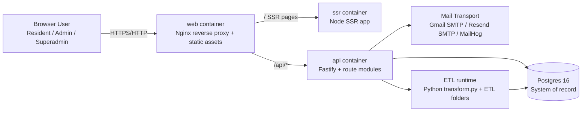
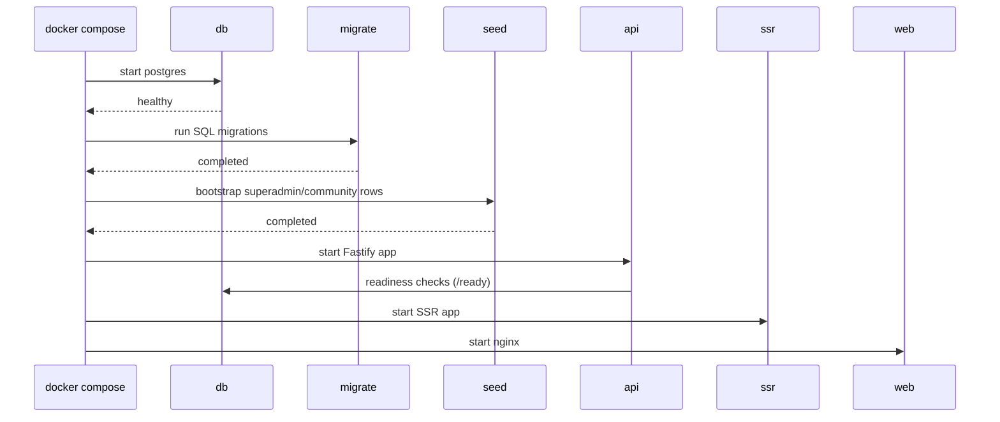
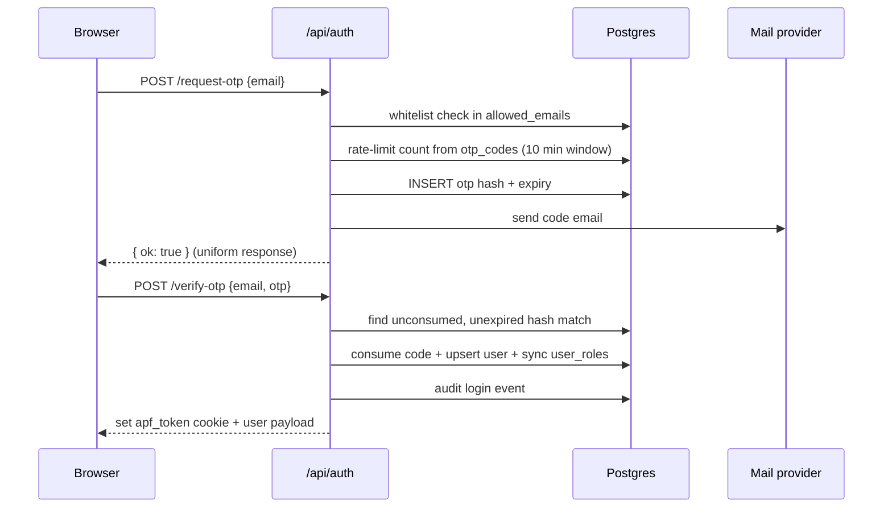
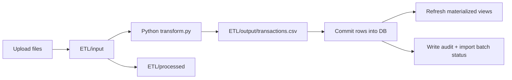

# Detailed System Architecture

This document describes how every major component in Apartment Ledger Pro works together at runtime.
It is implementation-accurate as of 2026-09-09 and aligned to the current code in backend, frontend, Docker Compose, and ETL modules.

## 1. System Context

## 2. Deployment Units and Responsibilities

| Unit | Location | Responsibility | Depends on |
| --- | --- | --- | --- |
| Web edge | web/Dockerfile, web/nginx.conf, docker-compose.yml | Terminates browser traffic, serves static frontend, proxies /api calls to API and page requests to SSR | ssr, api |
| SSR app | Docker target ssr | Server-rendered route shell for TanStack Start app | api (indirect through browser/API calls) |
| Frontend app | src/, routeTree.gen.ts | Route guard, session UX, dashboards, admin controls, calls backend APIs | api |
| API service | backend/src/server.ts + route modules | Auth, RBAC, dashboards, admin CRUD, imports, ETL orchestration, assistant | db, SMTP provider, ETL files |
| Database | postgres:16-alpine | Persistent data, auth whitelist, OTP hashes, transactions, rollups, audit | volume pgdata |
| ETL processing | ETL/ + backend/src/etl.ts | Receives uploaded source files, runs Python transform, imports transactions | filesystem + db |
| OTP mail provider | backend/src/routes/auth.ts | Delivers OTP email through Gmail/Resend/MailHog transport | SMTP credentials or MailHog service |

## 3. Runtime Startup Sequence

Operational notes:

- API startup hard-fails when JWT_SECRET is missing.
- In production mode, API startup hard-fails when COOKIE_SECURE is not true.
- /health is liveness-only, /ready validates DB reachability and migration table state.

## 4. Frontend Architecture

### 4.1 Routing and Shell

- Router bootstraps in src/router.tsx.
- Global auth and route access checks live in src/routes/__root.tsx (beforeLoad + RouteGuard).
- Shared chrome, navigation, period controls, and assistant UI live in src/components/portal-shell.tsx.

### 4.2 Session Model in Browser

- API auth is cookie-based (httpOnly cookie apf_token set by backend).
- Frontend keeps a lightweight session object in localStorage key apf.session for UX/routing.
- OTP in mock mode uses sessionStorage key apf.otp.
- Idle timeout logic (30 minutes) is enforced in root route guard via activity timestamps in sessionStorage.

### 4.3 Auth Mode Toggle

- src/lib/feature-flags.ts keeps AUTH_ENABLED effectively on for production builds.
- In local prototype mode, a dev toggle can bypass login and provide a guest admin session.
- When auth is enabled, /login is public and non-public routes require a session.

## 5. API Architecture

### 5.1 Core Composition

- App bootstrap and plugin registration in backend/src/server.ts.
- CORS, Helmet CSP, rate limit, multipart, and auth decorators are initialized globally.
- Routes are mounted as modular resources under /api/*.

### 5.2 Route Module Map

| Module | Prefix | Responsibility |
| --- | --- | --- |
| routes/auth.ts | /api/auth | request-otp, verify-otp, password login, logout |
| routes/me.ts | /api | current user profile and updates |
| routes/dashboard.ts | /api/dashboard | monthly totals, balance strip |
| routes/expenses.ts | /api/expenses | expense tree, category totals, anomalies |
| routes/income.ts | /api/income | income tree, category totals |
| routes/vendors.ts | /api/vendors | vendor ranking (read-only insight) |
| routes/collections.ts | /api/collections | collection efficiency and dues state |
| routes/admin.transactions.ts | /api/admin/transactions | transaction CRUD + rollup refresh |
| routes/admin.residents.ts | /api/admin/residents | whitelist and role management |
| routes/admin.settings.ts | /api/admin/settings | dashboard enable/hide controls |
| routes/admin.audit.ts | /api/admin/audit | immutable audit queries |
| routes/admin.imports.ts | /api/admin/imports | CSV batch upload, preview, commit |
| routes/admin.etl.ts | /api/admin/etl | ETL upload + transform + import sessions |
| routes/reports.ts | /api/reports | generated report metadata/files |
| routes/assistant.ts | /api/assistant | grounded AI assistant endpoint |

### 5.3 RBAC and Auth Decorators

- backend/src/auth.ts provides app.auth and app.requireRole([...]) decorators.
- app.auth verifies JWT from cookie and injects user claims {sub, email, roles, cid}.
- app.requireRole enforces role authorization at route level.
- Admin-control modules attach both auth and role pre-handlers.

## 6. OTP and Email Delivery Architecture

### 6.1 Provider Selection

Provider is selected by EMAIL_PROVIDER in backend/src/routes/auth.ts:

- gmail: smtp.gmail.com:465 with SMTP_USER + SMTP_PASS.
- resend: smtp.resend.com:465 with RESEND_API_KEY.
- mailhog: SMTP_HOST/SMTP_PORT (default host mailhog, port 1025).

### 6.2 OTP Generation and Storage

- OTP is generated by crypto.randomInt(100000, 1000000), producing a cryptographically secure 6-digit code.
- Plain OTP is emailed only; database stores sha256(otp) in otp_codes.
- TTL is 15 minutes.
- consumed_at marks one-time use and prevents replay.

### 6.3 OTP Verification Path

### 6.4 MailHog Decision Guidance

- If EMAIL_PROVIDER=gmail with valid SMTP_USER/SMTP_PASS, MailHog is not required for OTP delivery.
- MailHog remains useful for local testing where you do not want to send real emails.
- In production or Gmail-only environments, MailHog service can be omitted from Compose variants.

## 7. Data Architecture

### 7.1 Transaction-Centric Model

- transactions is the ledger fact table.
- heads, categories, vendors, line_items are dimensional context.
- balances and collections_dues support cash and dues analytics.

### 7.2 Auth and Access Tables

- allowed_emails controls who may request and verify OTP.
- users stores identity rows.
- user_roles stores effective roles.
- otp_codes stores hashed one-time codes.

### 7.3 Import and Audit Control Plane

- import_batches records upload sessions.
- import_staging stores raw/parsed rows and row-level errors.
- import_rules contains mapping transforms used by preview/commit flow.
- audit_log tracks every security-relevant and mutating action.

### 7.4 Rollups

- Materialized views mv_monthly_totals, mv_category_monthly, mv_vendor_ranking are refreshed after transaction-changing operations.
- backend/src/db.ts uses refreshRollups() with concurrent refresh fallback for mv_monthly_totals.

## 8. CSV Import and ETL Paths

There are two ingestion paths that converge into transactions.

### 8.1 Native CSV Import Wizard (/api/admin/imports)

1. Upload CSV by kind.
2. Rows are parsed and staged in import_staging.
3. Commit writes normalized rows into heads/categories/vendors/line_items/transactions.
4. Duplicate transactions are detected through ON CONFLICT(source, source_ref) DO NOTHING and surfaced as duplicate counts.
5. Audit row is written in same transaction.
6. Transaction rollups refresh after successful commit.

### 8.2 ETL-Assisted Import (/api/admin/etl/upload)

1. Multipart files (expense/receipt/vendor) are uploaded.
2. backend/src/etl.ts stores files under ETL/input.
3. Python transform.py runs with mapping config ETL/config/mapping.yaml.
4. Output transactions.csv is read and imported via per-row savepoint logic.
5. Source files are moved to ETL/processed.
6. Batch status and logs are exposed by ETL session endpoints.

## 9. Security Architecture

| Area | Control | Implemented in |
| --- | --- | --- |
| OTP entropy | crypto.randomInt CSPRNG | backend/src/routes/auth.ts |
| OTP secrecy | hash at rest, never plain persisted | backend/src/routes/auth.ts |
| OTP abuse resistance | request rate limit + attempt ceiling + expiry + one-time consumption | backend/src/routes/auth.ts |
| Session protection | httpOnly cookie, sameSite strict, configurable secure flag | backend/src/auth.ts |
| Environment hardening | startup refusal on missing JWT_SECRET and insecure prod cookie config | backend/src/auth.ts |
| Admin action traceability | transactional audit logging | backend/src/audit.ts + route modules |
| CSP and headers | helmet content security policy | backend/src/server.ts |

## 10. Observability and Ops

- API readiness endpoint exposes db + migration checks.
- Compose services define healthchecks for db, api, ssr, and web.
- ETL endpoints expose sessions and output files for operator visibility.
- Smoke script and CI workflow validate end-to-end startup and proxy wiring.

## 11. Known Implementation Nuances

- Frontend docs in older files may still reference bearer token/localStorage patterns, but runtime auth now relies on httpOnly cookie plus localStorage session metadata for UX only.
- OTP endpoint currently returns { ok: true } regardless of whitelist match to prevent user enumeration.
- Mail provider warnings are logged at API startup when provider credentials are missing.

## 12. Quick Traceability Index

| Concern | Primary file |
| --- | --- |
| Service wiring and middlewares | backend/src/server.ts |
| JWT/cookie and role decorators | backend/src/auth.ts |
| OTP generation, email transport, verify/login | backend/src/routes/auth.ts |
| Native CSV import flow | backend/src/routes/admin.imports.ts |
| ETL orchestration and import | backend/src/routes/admin.etl.ts |
| ETL file/process helpers | backend/src/etl.ts |
| Frontend API client | src/lib/api.ts |
| Frontend session and route access | src/lib/session.ts, src/routes/__root.tsx |
| Container topology and env defaults | docker-compose.yml, .env |
