# ETL Architecture Diagram

## System Overview

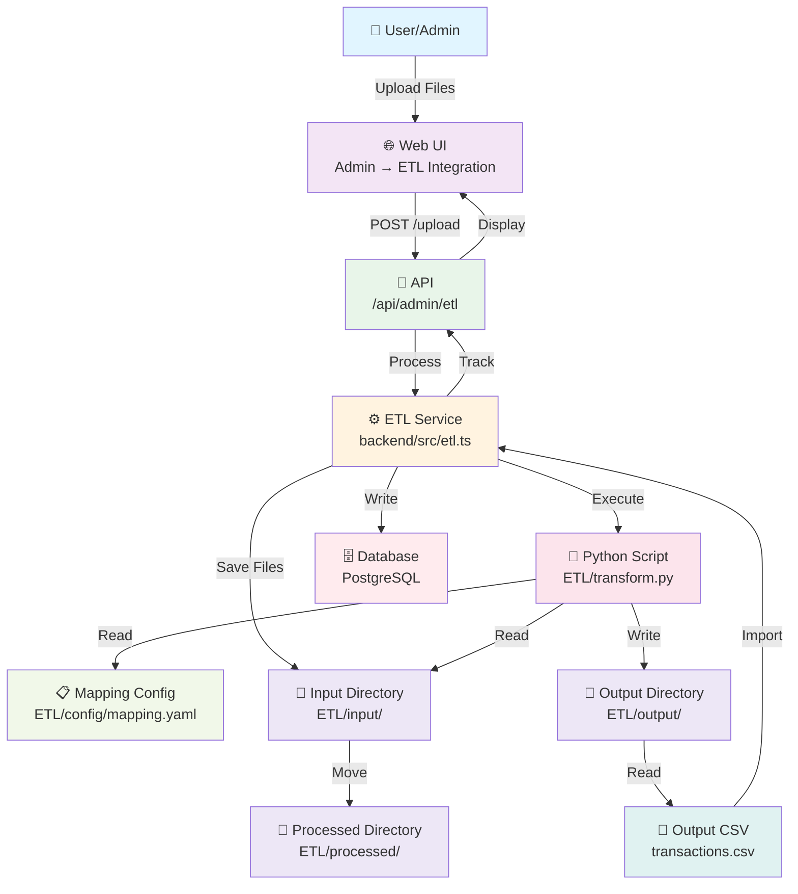

---

## Request Flow - File Upload

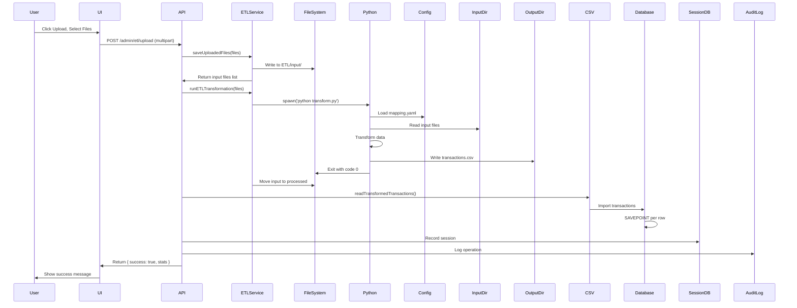

---

## Processing Pipeline

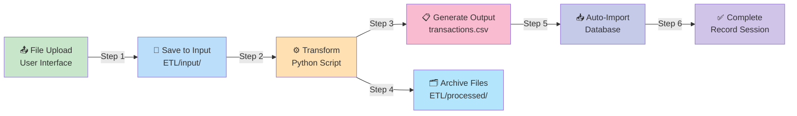

---

## Component Architecture

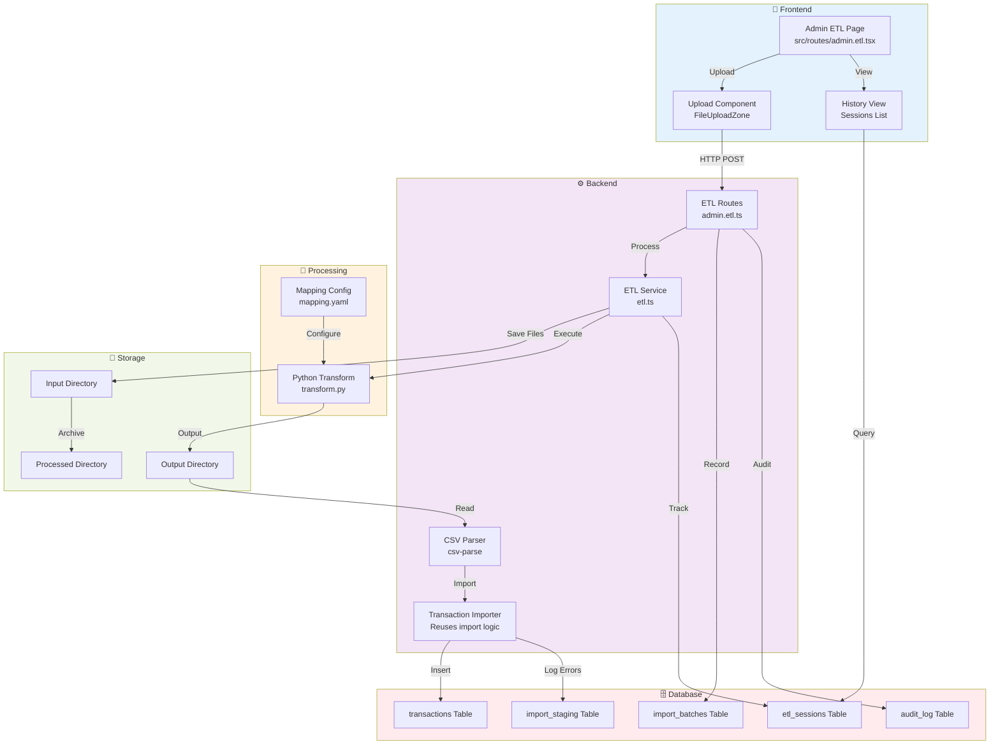

---

## Database Schema Relationships

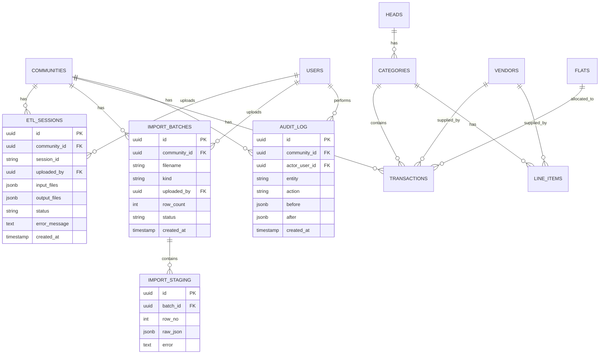

---

## State Diagram - ETL Session Lifecycle

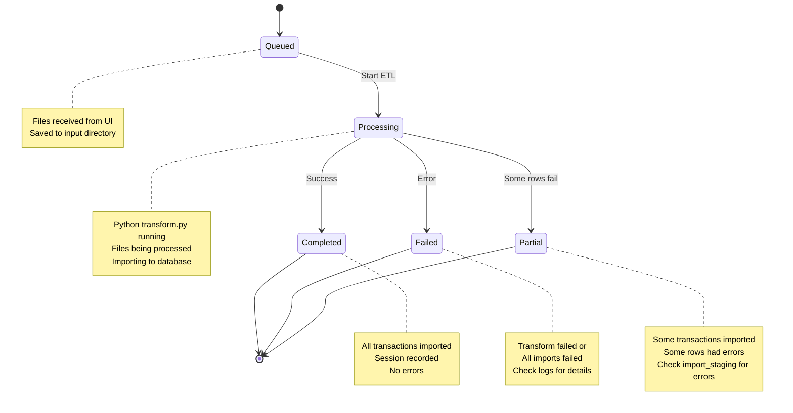

---

## Directory Structure - File Movement

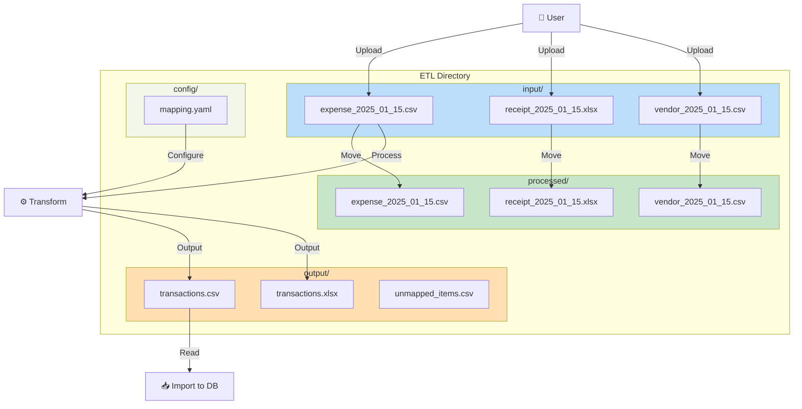

---

## API Call Flow

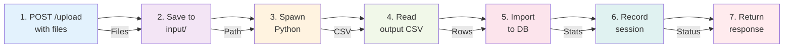

---

## Error Handling - SAVEPOINT Strategy

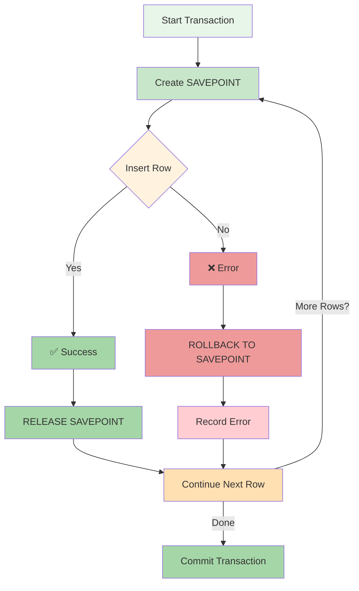

---

## Technology Stack

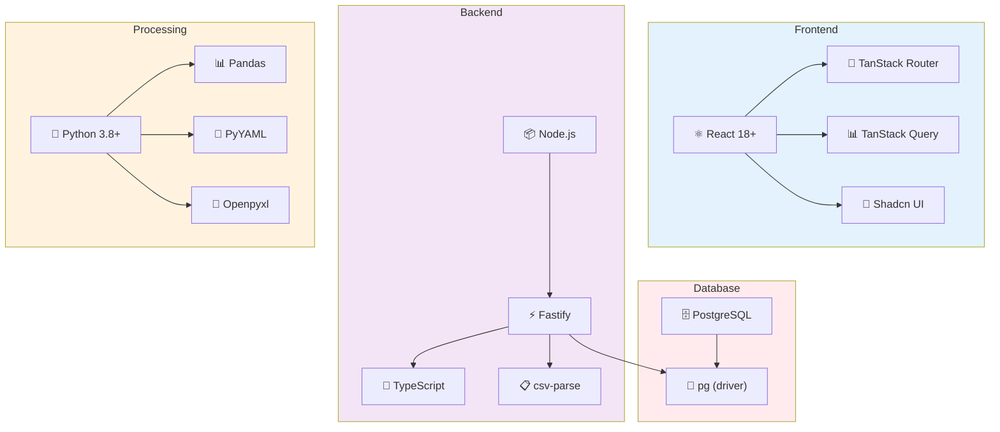

---

## Configuration Mapping Example

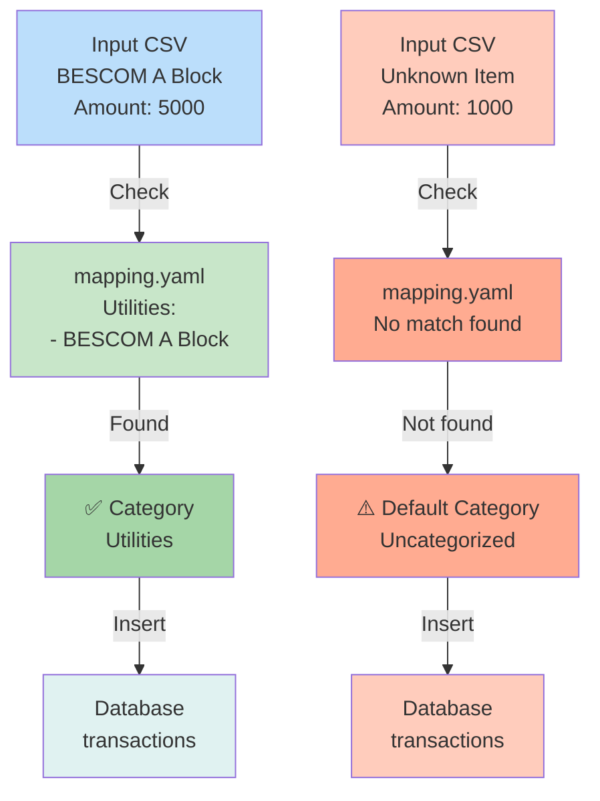

---

## Integration with Existing System

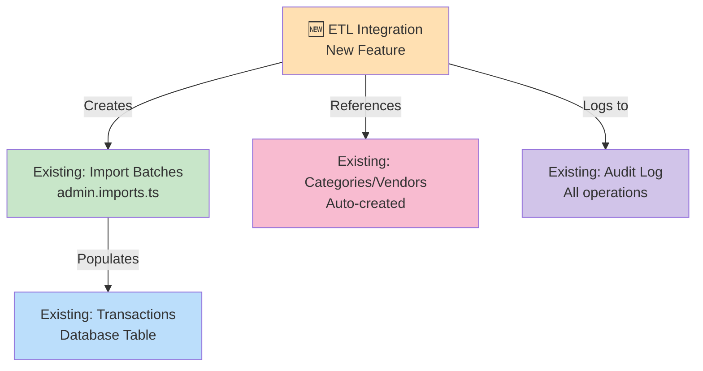

---

## Performance Timeline - Typical Upload

---

**Visual architecture created to help understand the system!** 📊

